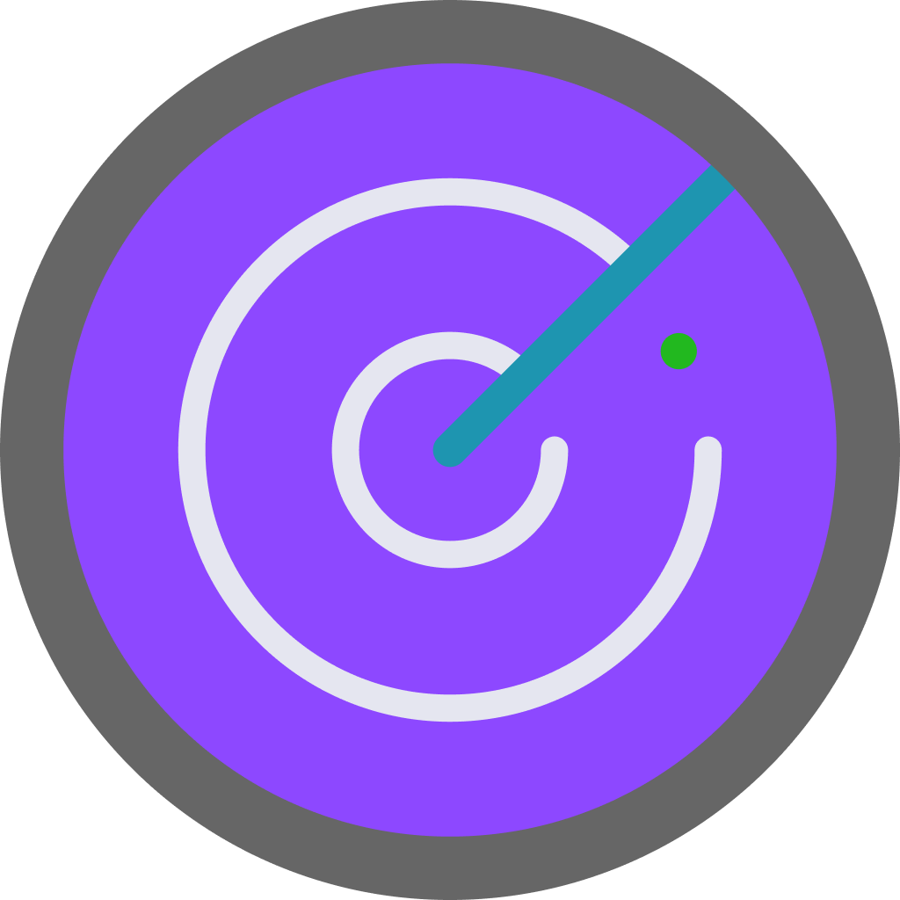

<div align="center" id="top"> 
  

  &#xa0;

  <!-- <a href="https://devradar.netlify.app">Demo</a> -->
</div>

<h1 align="center">DevRadar</h1>

<p align="center">
  

  

  

  

  <!--  -->

  <!--  -->

  <!--  -->
</p>

<!-- Status -->

<!-- <h4 align="center"> 
	🚧  DevRadar 🚀 Under construction...  🚧
</h4> 

<hr> -->

<p align="center">
  <a href="#dart-about">About</a> &#xa0; | &#xa0; 
  <a href="#sparkles-features">Features</a> &#xa0; | &#xa0;
  <a href="#rocket-technologies">Technologies</a> &#xa0; | &#xa0;
  <a href="#white_check_mark-requirements">Requirements</a> &#xa0; | &#xa0;
  <a href="#checkered_flag-starting">Starting</a> &#xa0; | &#xa0;
  <a href="#memo-license">License</a> &#xa0; | &#xa0;
  <a href="https://github.com/LDrawe" target="_blank">Author</a>
</p>

<br>

## :dart: About ##

DevRadar is a project built during "Semana OmniStack 10" to find nearby delevopers that works with the technologies that you request. It does this by using the user's location and show developers in a 10km radius using Haversine formula 

## :sparkles: Features ##

:heavy_check_mark: List Devs\
:heavy_check_mark: Add Devs\
:heavy_check_mark: Search Devs\
:heavy_check_mark: Delete Dev\
:heavy_check_mark: Realtime updates\
:heavy_check_mark: Validation\
:heavy_check_mark: Tests

## :rocket: Technologies ##

The following tools were used in this project:

- [Expo](https://expo.io/)
- [Node.js](https://nodejs.org/en/)
- [Socket.io](https://socket.io/)
- [React](https://pt-br.reactjs.org/)
- [React Native](https://reactnative.dev/)
- [TypeScript](https://www.typescriptlang.org/)

## :white_check_mark: Requirements ##

Before starting :checkered_flag:, you need to have [Node](https://nodejs.org/) and [Git](https://git-scm.com) (optional) installed.

## :checkered_flag: Starting ##

```bash
# Clone this project
$ git clone https://github.com/LDrawe/devradar
## or download and extract it

# Access
$ cd devradar

# Install dependencies of each folder (server, web, mobile)
$ cd directory
$ yarn install

# Run each module as you please
$ yarn start

```

## :memo: License ##

This project is under license from MIT. For more details, see the [LICENSE](LICENSE) file.


Made with :heart: by <a href="https://github.com/LDrawe" target="_blank">Eduardo Portilho</a>

&#xa0;

<a href="#top">Back to top</a>
